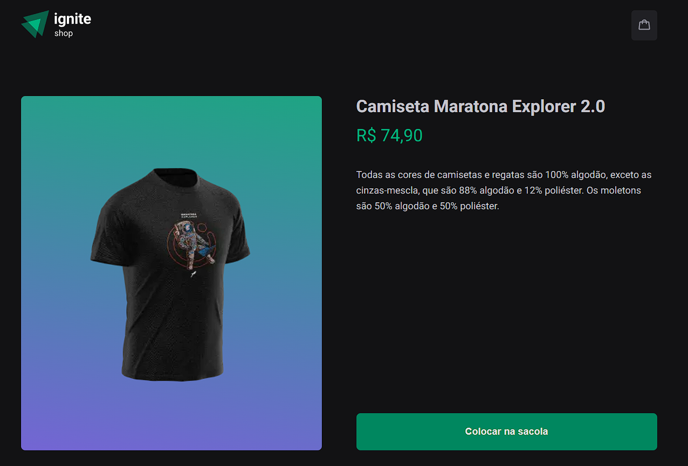
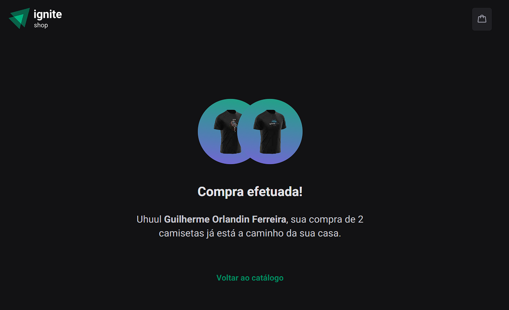

</div>

## ▶ Preview

[](https://04-ignite-shop-ten.vercel.app/)

## 📃 About

Ignite Shop, trata-se de um site de e-commerce de venda de camisetas em que o usuário pode adicionar os produtos ao seu carrinho logo na pagina home, ou se prefirir pode ler a descrição do produto e adiciona-lo a sua sacola de compras. Para finalizar a compra da camiseta o usuário terá que preencher seus dados do cartão.

## 🎨 Layout

- [Layout Figma - Original](https://www.figma.com/file/UnUZ4XLRVnv7l6ucDU4pLs/Ignite-Shop-2.0-(Copy)?node-id=0%3A1&t=B9fm2AMlatgpozaQ-0)

## 🛠 Build with

- [HTML]()
- [CSS]()
- [TypeScript]()
- [Next]()
- [Stripe]()

## 🎞 Demo





## 💻 Getting started

```sh
git clone https://github.com/GuiOrlandin/04-ignite-shop.git && cd 

04-ignite-shop

```

Download [live server](https://marketplace.visualstudio.com/items?itemName=ritwickdey.LiveServer) extension on vscode and run.